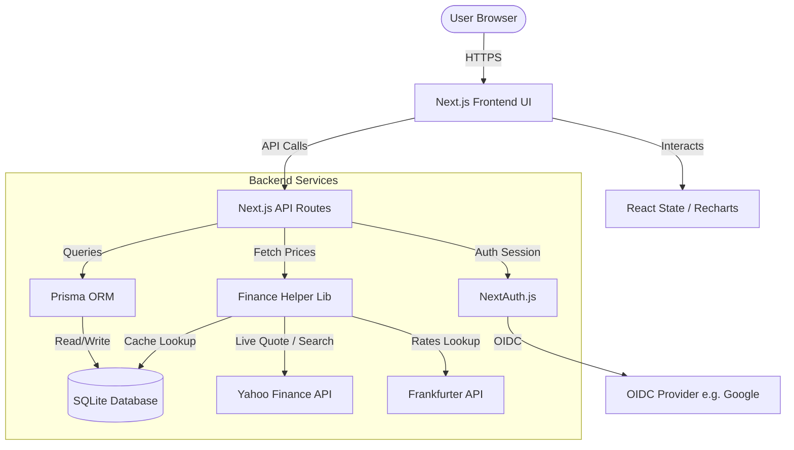

# 📈 Hold

A lightweight, high-performance, portfolio tracking application built with **Next.js 16 (App Router)**, **TypeScript**, **Tailwind CSS v4**, **Prisma**, and **SQLite**.

Designed for individual investors to track stock/ETF transactions, visualize portfolio performance over time, and analyze returns across multiple currencies with zero external API key requirements.

> NOTE: This project is developed using AI.

---

## 🛠️ Tech Stack

- **Frontend**: Next.js 16 (App Router, Client Components), Tailwind CSS v4, Recharts (Interactive Charts), Lucide React (Icons)
- **Backend**: Next.js Route Handlers (API Routes)
- **Database**: SQLite via Prisma ORM
- **Authentication**: NextAuth.js (v5 Beta) - Support for OIDC and Mock Developer Login
- **External APIs**: Yahoo Finance (Asset prices via `yahoo-finance2`), Frankfurter API (Exchange rates)

---

## 🏗️ Architecture & Data Flow

The following diagram illustrates how the application components interact:



---

## 🌟 Features

- **Transaction Logging**: Easily log buy and sell activities for any stock, ETF, or mutual fund.
- **Real-time & Historical Valuations**: Tracks your cost basis, current market valuations, and total returns.
- **Dynamic Performance Charts**: Interactive time-series charts (supporting 30D, YTD, 1Y, 5Y, and MAX views) with a brush timeline slider for custom zooming.
- **Multi-Currency Support**: View your portfolio dynamically in **USD ($)**, **EUR (€)**, **GBP (£)**, or **ILS (₪)**. Currency conversions use cached historical rates for accuracy on the transaction date.
- **Smart Caching**: Minimizes external API requests by caching historical asset prices and exchange rates in the local SQLite database.
- **CSV Data Portability**: Import historical transactions in bulk or export your current transaction log to CSV.
- **Hybrid Authentication**: Support for generic OpenID Connect (OIDC) providers alongside a toggleable mock developer login for local testing.

---

## 📁 Project Structure

```
/
├── prisma/                  # Database schema & migrations
│   ├── schema.prisma        # Prisma schema definition
│   └── migrations/          # SQLite database migrations
├── src/
│   ├── app/                 # Next.js App Router
│   │   ├── api/             # Backend API Route Handlers
│   │   │   ├── auth/        # NextAuth API configuration
│   │   │   ├── finance/     # Live stock search endpoints
│   │   │   ├── portfolio/   # Portfolio summary, history, import/export
│   │   │   └── transactions/# Individual transaction operations
│   │   ├── globals.css      # Global Styles (Tailwind v4 imports)
│   │   ├── layout.tsx       # Root layout & providers
│   │   └── page.tsx         # Dashboard main page (UI & client logic)
│   ├── components/          # Shared React components
│   │   └── Providers.tsx    # NextAuth Session Provider wrapper
│   ├── lib/                 # Business logic & utilities
│   │   ├── db.ts            # Prisma client instance
│   │   ├── finance.ts       # Yahoo Finance & Frankfurter API clients
│   │   └── portfolio.ts     # Portfolio aggregation & performance math
│   └── auth.ts              # NextAuth configuration & handlers
├── public/                  # Static assets
├── Dockerfile               # Multi-stage production build
└── package.json             # Project dependencies and scripts
```

---

## 🚀 Getting Started

### Prerequisites

- **Node.js**: `v20.x` or higher
- **Package Manager**: `pnpm` (recommended) or `npm`

### 1. Installation

Clone the repository and navigate to this directory:

```bash
# Using pnpm (recommended)
pnpm install

# Or using npm
npm install --legacy-peer-deps
```

### 2. Configure Environment Variables

Create a `.env` file in the root of the project:

```env
# Connection string for SQLite database (resolved relative to prisma/ directory)
DATABASE_URL="file:./data/hold.db"

# NextAuth secret key for encrypting session cookies (Generate with: openssl rand -base64 32)
AUTH_SECRET="your-super-secret-random-key"

# Enable local credentials-based fallback login (set to "false" in production)
ALLOW_DEV_LOGIN="true"

# (Optional) OpenID Connect OIDC provider configuration
# AUTH_OIDC_ISSUER="https://accounts.google.com"
# AUTH_OIDC_CLIENT_ID="your-client-id"
# AUTH_OIDC_CLIENT_SECRET="your-client-secret"
# AUTH_OIDC_NAME="Google Account"
```

### 3. Initialize the Database

Apply migrations to setup your SQLite database file. This will automatically create the `prisma/` folder and initialize `hold.db`:

```bash
npx prisma migrate dev
```

### 4. Run the Development Server

Start the Next.js development server:

```bash
# Using pnpm
pnpm dev

# Using npm
npm run dev
```

Open [http://localhost:3000](http://localhost:3000) in your browser.

---

## 🗃️ CSV Import Format

You can import transaction history in bulk via a CSV file. The CSV file must contain a header row.

| Column            | Required | Description                                                                      | Example Values             |
| :---------------- | :------: | :------------------------------------------------------------------------------- | :------------------------- |
| `symbol`          | **Yes**  | Stock ticker symbol compatible with Yahoo Finance                                | `AAPL`, `VWCE.DE`, `MSFT`  |
| `type`            | **Yes**  | Transaction type (case-insensitive)                                              | `BUY`, `SELL`              |
| `quantity`        | **Yes**  | Number of shares transacted (float)                                              | `10`, `2.5`                |
| `pricePerShare`   | **Yes**  | Price per share in the transaction currency (float). _Alias: `price`_            | `175.50`, `94.20`          |
| `currency`        |    No    | Currency of the transaction. If omitted, fetched automatically via ticker symbol | `USD`, `EUR`, `GBP`        |
| `fee`             |    No    | Transaction fee in the transaction currency. Defaults to `0`                     | `1.50`, `0`                |
| `transactionDate` |    No    | Date of the transaction. Defaults to today. _Alias: `date`_                      | `2023-10-25`, `2024-01-12` |

### Example CSV Content

```csv
symbol,type,quantity,pricePerShare,currency,fee,transactionDate
AAPL,BUY,10,175.50,USD,1.50,2023-10-25
VWCE.DE,BUY,5,102.30,EUR,2.00,2023-11-01
TSLA,SELL,2,220.00,USD,1.00,2023-11-15
```

---

## 🔐 Configuring OIDC (OpenID Connect)

The application supports standard OIDC providers (e.g., Google Identity, Keycloak, Auth0, Okta).

### Example: Google Identity Setup

1. Create OAuth 2.0 Credentials on the [Google Cloud Console](https://console.cloud.google.com/).
2. Set the Authorized Redirect URI to: `http://localhost:3000/api/auth/callback/oidc`.
3. Configure these variables in `.env`:
    ```env
    AUTH_OIDC_ISSUER="https://accounts.google.com"
    AUTH_OIDC_CLIENT_ID="your-google-client-id.apps.googleusercontent.com"
    AUTH_OIDC_CLIENT_SECRET="your-google-client-secret"
    AUTH_OIDC_NAME="Google Account"
    ```

---

## 🐳 Running in Docker (Production)

The project includes a multi-stage Dockerfile that builds a highly optimized production image (~130MB).

### 1. Build the Image

```bash
docker build -t hold .
```

### 2. Run the Container (with Persistence)

To prevent data loss when the container restarts, mount a host directory to `/app/prisma` where the SQLite database file (`hold.db`) is stored:

```bash
docker run -d \
  -p 3000:3000 \
  --name hold \
  --env-file .env \
  -v /absolute/path/to/local/db-folder:/app/data \
  hold:latest
```

> [!IMPORTANT]
> **Database Host Directory Permissions**:
> The container runs as a non-root user (`nextjs`, UID `1001`). Ensure your host directory `/absolute/path/to/local/db-folder` is writeable by UID `1001` or has appropriate read/write permissions.

> [!NOTE]
> **Automatic Database Initialization**:
> If the mounted host directory is empty on first startup, the container's entrypoint script will automatically copy a pre-migrated template database (`hold.db`) into it. Subsequent starts will preserve and use your existing data.

---

## 🔧 Useful Development Commands

- **Run Linter**: `npm run lint` or `pnpm lint`
- **Open Database Studio**: `npx prisma studio` (Visual explorer for your SQLite database)
- **Generate Prisma Client**: `npx prisma generate` (Run this after making changes to `schema.prisma`)
- **Create a Database Migration**: `npx prisma migrate dev --name <migration_name>`

---

_Note: This project is developed with AI assistance._
