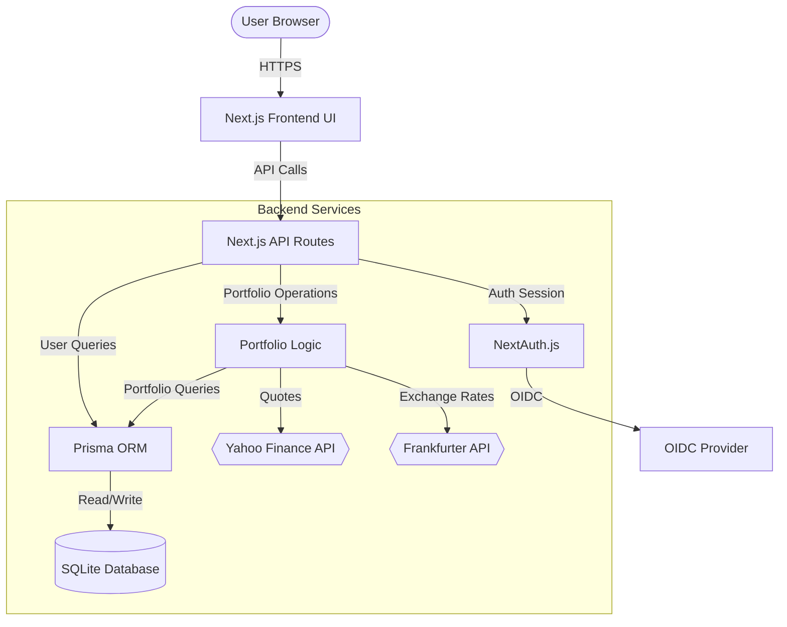

# 📈 Hold - Simple Portfolio Tracker

Hold lets you track your passive investment portfolio as easily as possible - log your BUY orders and let it handle the rest.

> NOTE: This project is developed using AI.

---

## 🌟 Features

- **Simple & Smart**
    - **Multi-currency support** - Convert all transactions to your desired currency on-the-fly.
    - **Stock-splits and dividends calculation** - Adjust holdings and valuation automatically.
    - **Import/export** all of your transactions to/from CSV.
    - **Multi-user support** - OIDC by default, optional demo user for first impression.
    - **Privacy mode** - hide absolute numbers and keep only percentage changes.

- **Visually appealing**
    - **Information boxes** present current status.
    - **Performance chart** shows portfolio progress over time.

---

## 📸 Screenshots

Web app (showcasing a 10:1 split and a 0.23$ dividend):


Mobile + Privacy mode:


---

## 🐳 Trying it out with Docker

Create a hold app on port 3000, with demo login enabled and mounted host directory for the database:

```bash
docker pull gabay/hold

docker run -d \
  -p 3000:3000 \
  -e ALLOW_DEMO_LOGIN=true \
  -e AUTH_URL=http://localhost:3000 \
  -e AUTH_SECRET="replace-this-message-with-64-byte-long-secret-password-right-now" \
  -v /absolute/path/to/db-folder:/app/data \
  gabay/hold:latest
```

> [!IMPORTANT]
> **Database Host Directory Permissions**:
> The container runs as a non-root user (`node`, UID `1000`). Ensure your host directory `/absolute/path/to/db-folder` is writeable by UID `1000` or has appropriate read/write permissions.

### 🐳 Using Docker Compose

Create a hold app using Docker Compose:

```docker-compose
services:
  hold:
    container_name: hold
    image: gabay/hold
    ports:
      - 3000:3000
    environment:
        ALLOW_DEMO_LOGIN=true
        AUTH_URL=http://localhost:3000
        AUTH_SECRET="replace-this-message-with-64-byte-long-secret-password-right-now"
        # when ready for production - fill and use these variables:
        # AUTH_OIDC_ISSUER=???
        # AUTH_OIDC_CLIENT_ID=???
        # AUTH_OIDC_CLIENT_SECRET=???
        # AUTH_OIDC_NAME=???
    volumes:
      - ./hold/:/app/data/
```

## 🚀 Running from source

#### Prerequisites

- **Node.js**: `v20.x` or higher
- **Package Manager**: `pnpm`

#### 1. Installation

Clone the repository and navigate to the root directory.

```bash
pnpm install
```

#### 2. Configure Environment Variables

Create a `.env` file in the root of the project:

```env
# Connection string for SQLite database (resolved relative to prisma/ directory)
DATABASE_URL="file:hold.db"

# NextAuth secret key for encrypting session cookies (Generate with: `openssl rand -base64 32`)
AUTH_SECRET="replace-this-message-with-64-byte-long-secret-password-right-now"

# Enable local credentials-based fallback login (set to "false" in production)
ALLOW_DEMO_LOGIN=true

# (Optional) OpenID Connect OIDC provider configuration
# AUTH_OIDC_ISSUER="https://AUTH_PROVIDER"
# AUTH_OIDC_CLIENT_ID="AUTH_PROVIDER_CLIENT_ID"
# AUTH_OIDC_CLIENT_SECRET="AUTH_PROVIDER_CLIENT_SECRET"
# AUTH_OIDC_NAME="AUTH_PROVIDER_NAME"
```

#### 3. Initialize the Database

Apply migrations to setup your SQLite database file. This will automatically create the `prisma/` folder and initialize `hold.db`:

```bash
npx prisma migrate dev
```

#### 4. Run the Development Server

Start the Next.js development server:

```bash
pnpm dev
```

Open [http://localhost:3000](http://localhost:3000) in your browser.

---

## 🗃️ CSV Import Format

You can import transaction history in bulk via a CSV file. The CSV file must contain a header row.

| Column            | Required | Description                                                           | Example Values             |
| :---------------- | :------: | :-------------------------------------------------------------------- | :------------------------- |
| `symbol`          | **Yes**  | Stock ticker symbol compatible with Yahoo Finance                     | `AAPL`, `VOO`, `CSPX.L`    |
| `type`            | **Yes**  | Transaction type (case-insensitive)                                   | `BUY`, `SELL`              |
| `quantity`        | **Yes**  | Number of shares transacted (float)                                   | `10`, `2.5`                |
| `pricePerShare`   | **Yes**  | Price per share in the transaction currency (float). _Alias: `price`_ | `175.50`, `94.20`          |
| `currency`        |    No    | Currency of the transaction. Default to ticker symbol                 | `USD`, `EUR`, `GBP`        |
| `transactionDate` |    No    | Date of the transaction. Defaults to today. _Alias: `date`_           | `2023-10-25`, `2024-01-12` |

### Example CSV Content

```csv
symbol,type,quantity,pricePerShare,currency,transactionDate
AAPL,BUY,10,175.50,USD,2026-01-01
VOO,SELL,2,220.00,USD,2026-01-02
CSPX.L,BUY,5,102.30,EUR,2026-01-03
```

---

## 🔐 Configuring OIDC (OpenID Connect)

The application supports standard OIDC providers.
OIDC is configured through the environment variables.

### Example: authentik Identity Setup

1. Create OAuth 2.0 Provider in the authentik admin interface.
2. Set the Authorized Redirect URI to: `http://localhost:3000/api/auth/callback/oidc` (or your hold instance's URL).
3. Configure these variables in `.env`:
    ```env
    AUTH_OIDC_ISSUER="https://AUTHENTIK_DOMAIN"
    AUTH_OIDC_CLIENT_ID="AUTHENTIK_CLIENT_ID"
    AUTH_OIDC_CLIENT_SECRET="AUTHENTIK_CLIENT_SECRET"
    AUTH_OIDC_NAME="authentik"
    ```

---

## 🛠️ Tech Stack

- **Frontend**: Next.js 16 (App Router, Client Components), Tailwind CSS v4, Recharts (Interactive Charts), Lucide React (Icons)
- **Backend**: Next.js Route Handlers (API Routes)
- **Database**: SQLite via Prisma ORM
- **Authentication**: NextAuth.js (v5 Beta) - Support for OIDC and Mock Developer Login
- **External APIs**: Yahoo Finance (Asset prices via `yahoo-finance2`), Frankfurter API (Exchange rates)

---

## 🏗️ Architecture & Data Flow

The following diagram illustrates how the application components interact:



---

## 📁 Project Structure

```
/
├── prisma/                  # Database schema & migrations
│   ├── schema.prisma        # Prisma schema definition
│   └── migrations/          # SQLite database migrations
├── src/
│   ├── app/                 # Next.js App Router
│   │   ├── api/             # Backend API Route Handlers
│   │   │   ├── auth/        # NextAuth API configuration
│   │   │   ├── finance/     # Live stock search endpoints
│   │   │   └── portfolio/   # Portfolio summary, history, import/export, transactions operations
│   │   ├── globals.css      # Global Styles (Tailwind v4 imports)
│   │   ├── layout.tsx       # Root layout & providers
│   │   └── page.tsx         # Dashboard main page (UI & client logic)
│   ├── components/          # Shared React components
│   ├── lib/                 # Business logic & utilities
│   │   ├── finance.ts       # Yahoo Finance & Frankfurter API clients
│   │   └── portfolio.ts     # Portfolio aggregation & performance math
│   └── auth.ts              # NextAuth configuration & handlers
├── public/                  # Static assets
├── Dockerfile               # production build
└── package.json             # Project dependencies and scripts
```

---

## 🔧 Useful Development Commands

- **Run Linter**: `pnpm lint`
- **Open Database Studio**: `npx prisma studio` (Visual explorer for your SQLite database)
- **Generate Prisma Client**: `npx prisma generate` (Run this after making changes to `schema.prisma`)
- **Create a Database Migration**: `npx prisma migrate dev --name <migration_name>`
- **Run Tests**: `pnpm test`
- **Run Tests with coverage**: `pnpm test --coverage`

---
